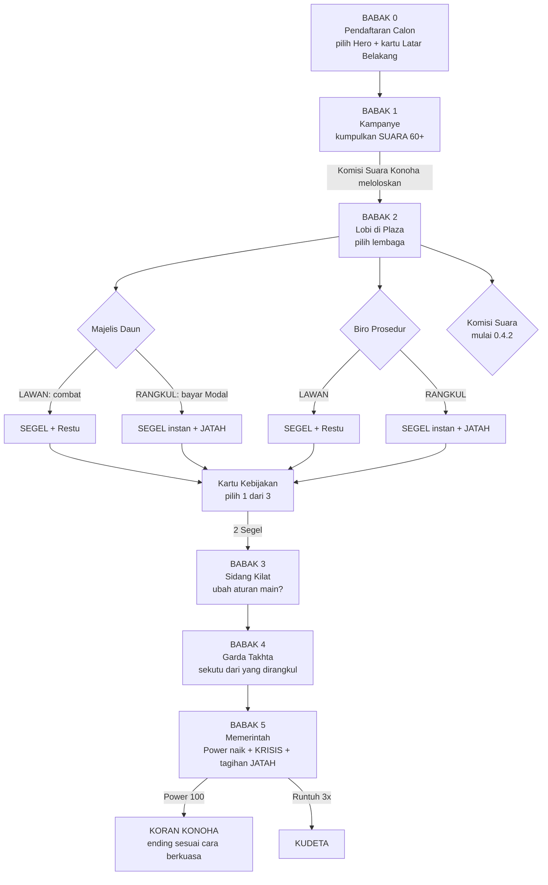
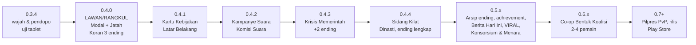

# JALUR TAKHTA v2 — "MUSIM PEMILU" (Design Authority 0.4.x)

Status: **DIKUNCI oleh owner, 2026-10-02** ("Aku setuju dengan rekomendasimu"). Mulai 0.4.0, dokumen ini menjadi **design authority** untuk alur campaign. `GAME_LOGIC_JALUR_TAKHTA_v1.md` tetap berlaku untuk hal yang tidak diubah di sini: combat, aturan Runtuh, angka musuh, Garda, dan arsitektur teknis.

Keputusan terkunci:
1. Struktur **Musim Pemilu**: Babak 0–5, lalu ending **Koran Konoha**.
2. Mulai dari **0.4.0**: LAWAN/RANGKUL untuk Majelis & Biro, resource **MODAL + JATAH**, dan Koran Konoha dengan 3 ending awal.
3. Untuk 0.4.0, RANGKUL dibayar dengan **Modal saja**. Koneksi menyusul.
4. Tingkat satir **tajam**. Sasarannya kebijakan, perilaku, dan sistem. **Tidak ada tuduhan pidana spesifik terhadap orang nyata.** Bingkai fiksi Negara Konoha tetap dipakai: nama, lembaga, dan lambang semuanya rekaan.

## Amandemen 0.5.0 — "Jalan Nyaleg" (owner, 2026-10-02)

Hasil uji 0.4.0: pemain bingung harus ke mana. "Majelis Daun" dan "Biro Prosedur" tidak dikenali dan terasa aneh. Owner meminta keduanya diganti dengan alur yang lebih menarik dan benar-benar mencerminkan Indonesia, serta kehidupan warga kota dan kampung yang terasa nyata.

Keputusan (berlaku di atas §4 di bawah):
- **Alur = jalan nyaleg yang dikenal semua orang Indonesia.** Setiap tahap bernomor dan terlihat di daftar langkah:
  1. **Gang:** usir *Preman Bayaran* (dulu Kroni).
  2. **Blusukan (baru):** sapa 3 kelompok warga (pos ronda, ibu-ibu di tukang sayur, pangkalan ojol) untuk SUARA 3/3.
  3. **Rekomendasi Koalisi:** dulu Majelis Daun. Mekaniknya sama (Elite Partai saling melindungi, Ketum mengetok palu). RANGKUL = **BAYAR MAHAR**.
  4. **Berkas di Kantor Kelurahan:** dulu Biro Prosedur. Loket FOTOKOPI KTP, CAP RT/RW, dan LEGALISIR, Petugas "Jam Istirahat", serta Pak Lurah "BALIK BESOK!". RANGKUL = **BAYAR CALO**.
  5. **Pelantikan:** Garda Istana.
  6. **DUDUK di Kursi**, lalu Koran Konoha.
- **Arahan:** daftar langkah ✓ selalu tampil, dan pilar cahaya emas berdiri di tujuan berikutnya.
- **Kehidupan warga:**
  - warga *kepo* merekam perkelahian dengan HP;
  - rumah duka (bendera kuning, tenda, kursi plastik, pelayat);
  - ibu-ibu ngerumpi di tukang sayur, bapak-bapak di pos ronda, pangkalan ojol;
  - motor bonceng tiga;
  - kerumunan di lokasi motor jatuh.
- Nama kode internal (`MajelisDaun`, `BiroProsedur`, `CampaignSector`) **tidak** diubah supaya save, test, dan arsitektur tetap stabil. Yang berubah hanya nama yang dilihat pemain.
- Rencana 0.4.1–0.4.4 (Kartu Kebijakan, Krisis, Sidang Kilat) tetap berlaku, dan nomornya bergeser menjadi 0.5.x.

Penjelasan alasan dan diagnosis alur lama ada di `Docs/REKOMENDASI_ALUR_JALUR_TAKHTA_v2.md`.

---

## 1. Bisa dimainkan berapa orang?

| Mode | Pemain | Status | Isi |
|---|---|---|---|
| **JALUR TAKHTA: Musim Pemilu** | **1 (solo)** | Dikerjakan 0.4.x | Mode utama: satu calon melawan sistem |
| **BENTUK KOALISI** (co-op) | **2–4**, satu tim | Setelah inti solo terbukti seru (target 0.6.x) | Satu Musim Pemilu dimainkan bersama. Kursi cuma satu, jadi di akhir koalisi harus memilih siapa yang duduk. Jatah dibagi, dan pengkhianatan antar-teman bisa terjadi. |
| **REBUT KURSI** (PvP) | **4 vs 4** | Sudah ada (prototipe), dijaga tetap jalan | Dua kubu berebut satu Kursi |
| **PILPRES** (PvP bebas) | 3–4 calon, saling lawan | Ide jangka panjang (0.7+) | Semua pemain adalah calon dan berebut Suara, Segel, dan Kursi di peta yang sama |

**Kenapa solo dulu:** semua mode multipemain memakai isi yang sama (lembaga, kartu, krisis, ending). Kalau isinya belum seru dimainkan sendirian, co-op juga tidak akan seru. Fondasi teknisnya sudah disiapkan: solo campaign berjalan sebagai **host Netcode lokal**, dan semua keputusan aturan ada di sisi host.

**Syarat teknis multipemain online** (nanti, perlu diverifikasi biayanya saat waktunya): layanan relay dan lobby, misalnya Unity Relay + Lobby yang punya kuota gratis terbatas. Selain itu diperlukan uji di minimal 2 perangkat, dan PvP memerlukan pencocokan pemain. Semua ini masuk fase 0.6.

---

## 2. Satu run dalam gambar

Durasi target satu run: **12–15 menit**. Setiap run harus terasa berbeda karena kombinasi Latar Belakang, Kartu Kebijakan, pilihan Lawan/Rangkul, dan Krisis.

---

## 3. Resource

| Resource | Mulai | Arti | Cara naik | Cara turun / akibat |
|---|---|---|---|---|
| **WIBAWA** | ada | HP hero | — | 0 → Runtuh |
| **PENGARUH** | ada | Pengisi ULT | memukul, Segel | Runtuh −30% |
| **SEGEL** | ada | Akses Gerbang Dalam (butuh 2) | Lawan atau Rangkul lembaga | — |
| **MODAL** | 0.4.0 | Uang politik | Latar Belakang, mengalahkan musuh (sedikit), kartu tertentu | Rangkul, Bansos, bayar Jatah |
| **JATAH** | 0.4.0 | Utang politik ke lembaga yang dirangkul | +1 setiap Rangkul | Ditagih saat Memerintah: bayar Modal, atau dia berkhianat |
| **RESTU** | 0.4.0 (menggantikan RESTU RAKYAT yang sekarang hanya buff) | Dukungan rakyat 0–100 | Melawan lembaga, Dengar demo, Taat Konstitusi | Bansos ketahuan, bubarkan demo, ubah aturan |
| **SUARA** | 0.4.2 | Syarat lolos Kampanye (60) | Blusukan, Debat, Bansos | — |
| **KONEKSI** | 0.4.4+ | Jalan pintas sosial | Kartu, Latar Belakang | Dipakai untuk Rangkul tanpa Modal |

Semua angka di atas adalah nilai awal dan disetel ulang setelah diuji di tablet. Angka disimpan di satu tempat (`CampaignTuning`).

---

## 4. Babak per babak (detail)

### Babak 0 — Pendaftaran Calon
- Layar pilih hero yang sekarang, ditambah **3 kartu Latar Belakang acak** (pilih 1).
- Kartu: **Anak Pejabat**, **Pengusaha Tambang**, **Mantan Jenderal**, **Aktivis Kampus**, **Artis Viral**, **Ustaz Kondang**. Efeknya di dokumen rekomendasi §3.
- Satir: kartu terkuat diam-diam selalu "Anak Pejabat". Teks kecil di bawahnya: *"Kartu ini tidak muncul acak. Kartu ini muncul karena kenal orang."*

### Babak 1 — Kampanye (0.4.2)
- Peta: Gerbang Rakyat dan kampung di jalan samping (sudah ada).
- **Blusukan:** tiga zona kerumunan warga. Berdiri di dalamnya mengisi Suara, sementara **Buzzer Bayaran** (Kroni yang ada, dengan nameplate baru) menyerang.
- **Bansos:** gerobak sembako. Bayar Modal untuk Suara instan, lalu warga berebut. Peluang 30% "ketahuan wartawan": Restu −10.
- **Debat Kandidat:** mini-boss "Calon Boneka" di panggung. Ia menyerang dengan "Data Ngawur" (proyektil teks).
- Gerbang ke Plaza dibuka **Komisi Suara Konoha** pada Suara 60+. Kalau Suara kurang, pemain bisa "Gugat ke Mahkamah": tunggu 20 detik sambil bertahan dari gelombang musuh, lalu lolos dengan Restu −15.

### Babak 2 — Lobi (0.4.0)
- Plaza Aspirasi menjadi hub. Saat pemain masuk zona lembaga, muncul panel:
  - **LAWAN:** encounter faksi yang sudah ada. Hasil: Segel, Pengaruh +25, Restu +10.
  - **RANGKUL — bayar X Modal:** encounter dilewati. Hasil: Segel instan, Jatah +1, dan anggota faksi berlutut atau bergabung sebagai sekutu di Garda.
  - Kalau Modal kurang, tombol RANGKUL abu-abu bertuliskan *"Modal kurang. Coba lahir di keluarga lain."*
- Animasi Rangkul (satir): Majelis menggelar "rapat tertutup" (layar gelap, jam di HUD berubah ke 02.00, lalu bunyi ketok palu). Biro membuka "jalur khusus" (loket langsung tercap, antrean warga menatap).
- Setelah setiap lembaga: **Kartu Kebijakan**, pilih 1 dari 3 (0.4.1).

### Babak 3 — Sidang Kilat (0.4.4)
Pilih 1 aturan baru sebelum Gerbang Dalam:
| Kartu | Efek main | Efek satir |
|---|---|---|
| **Revisi Batas Usia** | NPC "calon pendamping" ikut bertarung di Garda | Restu −10, membuka jalan ke ending Dinasti |
| **Perpanjang Masa Jabatan** | Target Power 100 → 80 | Krisis datang 30% lebih sering |
| **Tunda Pemilu** | Garda kehilangan 1 Guard | Krisis Demo Mahasiswa pasti muncul dan lebih besar |
| **Omnibus Semalam** | Semua kartu kebijakan +1 level | Jatah +1 (semua lembaga minta bagian) |
| **Taat Konstitusi** | Tidak ada bonus | Restu +15, satu-satunya jalan ke Mandat Rakyat |

### Babak 4 — Garda Takhta (ada, dimodifikasi 0.4.0)
- Lembaga yang **dirangkul** mengirim 1–2 sekutu (AI pendukung sederhana) ke arena.
- Lembaga yang **dilawan** mengirim "sisa pasukan" saat Panglima di bawah 50% HP (perilaku sekarang).

### Babak 5 — Memerintah (0.4.3)
- Power naik saat duduk (seperti sekarang). Setiap 15–20 detik datang **KRISIS** (acak, tanpa berulang dalam satu run):

| Krisis | Cara main | Pilihan | Fenomena yang disindir |
|---|---|---|---|
| **Demo "Tunjangan Naik"** | Massa besar bergerak ke Istana | **DENGAR**: berdiri di podium 6 detik, Power berhenti, Restu +15. **BUBARKAN**: water cannon, cepat, Restu −20, meter VIRAL naik | Tunjangan wakil rakyat naik di tengah kesulitan rakyat; demo Agustus 2025 dan 2026 |
| **Koalisi Minta Jatah** | Setiap Jatah datang sebagai NPC penagih bermap | **BAYAR** Modal, atau **TOLAK**: dia jadi musuh elite | Bagi-bagi kursi, kabinet gemuk |
| **BBM Naik** | Semua gerak −20% sampai "Operasi Pasar" (zona) selesai | — | Kenaikan BBM dan rupiah melemah |
| **Nasi Kotak Misteri** | NPC membagi makan gratis. Ambil = heal, tetapi 1 dari 4 membuat "keracunan" (stun) | Hentikan pembagian: Restu −5 | Program makan gratis yang bermasalah (keracunan, korupsi) |
| **Pagar Laut** | Pagar bambu misterius muncul memotong arena, harus dihancurkan | "Siapa yang pasang?": tidak ada yang mengaku | Pagar laut bersertifikat |
| **Skandal Viral** | Jika Jatah/Utang tinggi, datang **Komisi Antirasuah (fiktif)** | Lawan (Restu −) atau **Konferensi Pers Klarifikasi** (bertahan di zona 10 detik) | Budaya klarifikasi, kasus korupsi besar |
| **Banjir Ibu Kota** | Sebagian plaza tergenang, gerak lambat di air | — | Banjir tahunan, tata kota |
| **#KaburAjaDulu** | Warga berlarian ke kapal di teluk; tiap warga yang lolos −Restu | Tahan mereka dengan "Lapangan Kerja" (zona) | Anak muda ingin pindah ke luar negeri |

### Ending — Koran Konoha (0.4.0: 3 ending; lengkap di 0.4.4)
Layar hasil berupa koran: judul besar, foto hero, dan 3 berita kecil yang dirangkai dari pilihan pemain selama run (misalnya "Menteri ke-74 Dilantik", "Loket Biro Kini Punya Jalur Khusus").

| Ending | Syarat (awal) | Versi |
|---|---|---|
| **TAKHTA BESI** | Semua lembaga dilawan | 0.4.0 |
| **RAJA KOALISI** | Mayoritas lembaga dirangkul | 0.4.0 |
| **BONEKA SISTEM** | Jatah ≥ 3, atau Jatah belum dibayar saat menang | 0.4.0 |
| **MANDAT RAKYAT** | Restu ≥ 80, Jatah 0, Taat Konstitusi | 0.4.3/0.4.4 |
| **SULTAN MODAL** | Modal ≥ 200 saat menang | 0.4.3 |
| **DINASTI** (rahasia) | Revisi Batas Usia + kartu Anak Pejabat | 0.4.4 |
| **KUDETA** (kalah) | Runtuh 3× saat Memerintah | ada |

---

## 5. Analisis satir: Indonesia beberapa tahun terakhir → unsur game

Ringkasan fenomena publik yang banyak diberitakan (2019–2026). Semuanya diterjemahkan ke dunia **fiksi Konoha** dan menyasar **pola**, bukan orang. Sumber berita ada di akhir dokumen.

| # | Pola yang terjadi | Contoh yang diberitakan | Jadi apa di game |
|---|---|---|---|
| 1 | **Aturan diubah cepat demi kepentingan** | Revisi UU KPK (2019); UU Cipta Kerja omnibus (2020); putusan batas usia capres-cawapres (2023) yang berujung sanksi etik bagi ketua majelis hakimnya; upaya mengubah aturan Pilkada yang memicu "Peringatan Darurat" (Agt 2024); revisi UU TNI (Mar 2025) | **Sidang Kilat**; Majelis **ketok palu jam 02.00**; kartu **Omnibus Semalam**; lembaga fiktif **Mahkamah Kekeluargaan Konoha** (0.5) |
| 2 | **Dinasti & orang dalam** | Keluarga pejabat memegang banyak jabatan daerah; demo nepotisme di Kaltim (Apr 2026) | Kartu **Anak Pejabat**; ending **DINASTI**; kartu **Ordal** |
| 3 | **Wakil rakyat yang jauh dari rakyat** | Tunjangan rumah anggota DPR yang memicu kerusuhan Agt 2025 dan tuntutan 17+8; aksi peringatan setahunnya (Agt 2026) | Krisis **Demo "Tunjangan Naik"**; anggota Majelis kadang **joget** saat diserang; Majelis "tidur di sidang" (stun singkat) |
| 4 | **Korupsi skala raksasa, hukuman ringan** | Kasus timah dengan kerugian ratusan triliun; kasus tata kelola BBM (2025); RUU Perampasan Aset yang mangkrak sejak 2008 dan dijanjikan disahkan sebelum 15 Des 2026 | **Komisi Antirasuah (fiktif)**; kartu **Diskon Hukuman**; RUU **Perampasan Aset** sebagai kartu langka yang membuat ending Sultan Modal mustahil |
| 5 | **Program populis besar yang bocor** | Program makan bergizi gratis ±US$15 miliar/tahun dengan kasus keracunan berulang dan dugaan korupsi (pengelolanya dicopot, 2026); efisiensi anggaran (Inpres 1/2025) berjalan bersamaan dengan kabinet yang sangat besar | Krisis **Nasi Kotak Misteri**; ending **RAJA KOALISI** ("Menteri ke-74 dilantik"); kartu **Efisiensi** (semua lambat, kecuali rombongan pejabat) |
| 6 | **Ekonomi rakyat makin sempit** | PPN naik (2025); antrean gas 3 kg (Feb 2025); gelombang PHK; PBB naik ratusan persen di beberapa daerah (Agt 2025); BBM naik ±32% dan rupiah ±18.000/US$ (Jun 2026); #KaburAjaDulu | Krisis **BBM Naik**, **#KaburAjaDulu**; Kroni "**Penagih Pajak**"; NPC warga antre gas |
| 7 | **Militer masuk urusan sipil** | Revisi UU TNI dan kekhawatiran "dwifungsi"; tuntutan mahasiswa 2026 soal militerisasi | Kartu **Prajurit Serba Bisa** (Guard menjaga loket Biro); ending Takhta Besi bertambah "parade" |
| 8 | **Proyek, lahan & lingkungan** | Ibu kota baru yang melambat; proyek strategis yang memicu konflik lahan; pagar laut bersertifikat (2025); tambang nikel di kawasan wisata laut (2025) | Lembaga **Konsorsium Modal** (0.5); krisis **Pagar Laut**; ending Sultan Modal ("Ibu Kota Pindah ke Lahan Milik Sendiri") |
| 9 | **Kritik yang dibungkam** | Pasal karet ITE; KUHP baru berlaku Jan 2026; gas air mata & water cannon; penangguhan izin platform yang dipakai siaran langsung demo (Okt 2025) | Kartu **Pasal Karet**; skill musuh **"Matikan Live"** (meter VIRAL dikosongkan) |
| 10 | **"No viral, no justice"** | Kasus baru diproses setelah viral | **Meter VIRAL**: krisis selesai lebih cepat kalau sedang viral |
| 11 | **Pamer pejabat & gelar instan** | Mobil dinas mewah di tengah efisiensi (Kaltim 2026); polemik gelar akademik kilat | Musuh elite "**Pejabat Flexing**" (menjatuhkan barang mewah); kartu **Gelar Doktor Kilat** (+Wibawa, −Restu) |
| 12 | **Ormas & pungli** | Ormas meminta "THR" dan jatah parkir | Kroni "**Ormas Parkir**" di Kampanye: harus dibayar atau dilawan |
| 13 | **Buzzer, survei, baliho** | Perang narasi di media sosial menjelang pemilu | **Buzzer Bayaran**; lembaga **Menara Narasi** (0.5); baliho raksasa yang bisa dihancurkan |
| 14 | **Birokrasi digital rapuh** | Serangan ransomware ke pusat data nasional (2024) | Biro: **"Sistem Sedang Gangguan"** (loket berhenti 5 detik secara acak) |

**Sindiran personal hero** (tajam, tanpa tuduhan pidana): setiap hero mendapat 3–4 baris ucapan, satu kartu khas, dan headline ending sendiri. Contoh nada, bisa disetel owner:
- **MEGA:** trah dan "petugas partai". Kartu khas **"Restu Ketua Umum"**: sekutu Majelis lebih murah dirangkul.
- **GEMOY:** joget dan makan gratis. Kartu khas **"Joget Kemenangan"**: heal setelah menang encounter.
- **ABAH:** narasi perubahan dan debat. Kartu khas **"Data dan Fakta"**: Calon Boneka kalah lebih cepat.
- **PAK WI:** blusukan dan proyek. Kartu khas **"Estafet"**: membuka ending Dinasti lebih mudah.

Prinsip: **keempat hero disindir sama kerasnya**, dan tidak ada hero yang "paling benar".

---

## 6. Workflow pengerjaan ke depan

| Versi | Isi | Selesai bila | Yang owner lakukan |
|---|---|---|---|
| **0.3.4** | Wajah warga, mata berkedip, pendopo tidak hilang | Diuji di tablet | Build & uji (sudah ada branch) |
| **0.4.0** | Panel LAWAN/RANGKUL di Majelis & Biro; MODAL (awal 60, +2 per musuh); JATAH; RESTU 0–100; HUD resource; sekutu di Garda; **Koran Konoha** (3 ending); disclaimer di menu | Bisa menang lewat ketiga jalur dan koran berbeda | Uji 3 run: lawan semua, rangkul semua, campuran |
| **0.4.1** | 10 Kartu Kebijakan + 6 kartu Latar Belakang | Run terasa berbeda karena kartu | Uji 3 run, nilai kartu mana yang seru |
| **0.4.2** | Babak Kampanye: Suara, Blusukan, Bansos, Buzzer, Calon Boneka, Komisi Suara Konoha | Lolos Kampanye dalam ±3 menit | Uji, nilai durasi |
| **0.4.3** | 6 Krisis + tagihan Jatah + ending Mandat Rakyat & Sultan Modal | Memerintah terasa genting, bukan menunggu | Uji |
| **0.4.4** | Sidang Kilat + ending Dinasti + koran berita berantai | Semua ending bisa dicapai | Uji, cari ending rahasia |
| **0.5.x** | Arsip ending, achievement satir, Berita Hari Ini, meter VIRAL, kostum, Konsorsium Modal, Menara Narasi | Alasan main lagi tiap hari | Uji retensi: masih ingin main besok? |
| **0.6.x** | Co-op Bentuk Koalisi (lokal dulu, lalu online via relay) | 2 tablet bisa main bersama | Siapkan 2 perangkat |
| **0.7+** | Pilpres PvP, keystore tetap, kebijakan Play Store, rating usia, aset final | Siap rilis tertutup | Akun Play Console |

**Aturan kerja tetap sama:** satu versi = satu branch = satu build di Unity Build Automation. Owner menguji di tablet, lalu baru di-merge. Tidak ada klaim "PASS" sebelum ada laporan owner.

---

## 7. Rencana teknis 0.4.0 (untuk pelaksana)

- `CampaignRunState` (C# murni, ada test): tambah `Modal`, `Jatah`, `Restu`, `SectorPath { Belum, Dilawan, Dirangkul }` per lembaga, dan `EndingFor(state)` (pure, ada test).
- `CampaignTuning`: `RangkulCost` (Majelis 60, Biro 45), `ModalStart` 60, `ModalPerKill` 2, `RestuLawan` +10, `BonekaJatah` 3.
- Panel pilihan (UI baru): muncul saat masuk radius lembaga yang belum selesai. Encounter baru di-spawn setelah memilih LAWAN. RANGKUL: Segel langsung, musuh faksi berlutut lalu hilang, dan 1–2 di antaranya dicatat sebagai sekutu Garda.
- Sekutu Garda: memakai `CampaignEnemy` dengan tim berbeda dan target musuh. Ini perlu diaudit dulu; kalau berisiko, cukup "pasukan berdiri bersorak" untuk 0.4.0.
- `CampaignResult` → layar **Koran Konoha** (UI dari kode: kertas krem, judul serif besar, 3 kolom berita).
- Disclaimer satir di menu mode.
- PvP: tidak disentuh.

---

## Sumber berita (konteks 2025–2026)
- [2025–2026 Indonesian protests — Wikipedia](https://en.wikipedia.org/wiki/2025%E2%80%932026_Indonesian_protests)
- [August 2025 Indonesian protests — Wikipedia](https://en.wikipedia.org/wiki/August_2025_Indonesian_protests)
- [17+8 Demands — Wikipedia](https://en.wikipedia.org/wiki/17%2B8_Demands)
- [Indonesians march on parliament to demand crackdown on corruption — Al Jazeera, 28 Agt 2026](https://www.aljazeera.com/news/2026/8/28/indonesians-march-on-parliament-to-demand-crackdown-on-corruption)
- [Indonesian students protest gov't policies amid economic strain — Al Jazeera, 12 Jun 2026](https://www.aljazeera.com/news/2026/6/12/indonesian-students-protest-govt-policies-amid-economic-strain)
- [2026 East Kalimantan protests — Wikipedia](https://en.wikipedia.org/wiki/2026_East_Kalimantan_protests)
- [2024 Indonesian local election law protests — Wikipedia](https://en.wikipedia.org/wiki/2024_Indonesian_local_election_law_protests)

Fenomena 2019–2024 (revisi UU KPK, UU Cipta Kerja, putusan batas usia capres-cawapres, serangan ransomware pusat data nasional) berasal dari pengetahuan umum yang banyak diberitakan saat itu. Sebelum dijadikan teks di dalam game, setiap rujukan peristiwa tetap dicek ulang.
